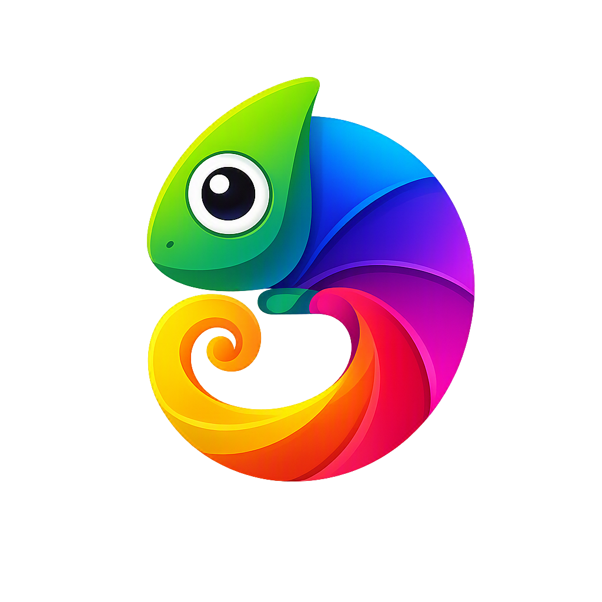

# Chameleon UI

<p align="center">
  
</p>

> **简体中文 · [English](README.en.md) · [繁體中文（香港）](README.zh-HK.md) · [العربية](README.ar.md)**

**AI-native, headless-first, three-end（390/768/1280）, cross-framework design system for React and Vue.**

Chameleon UI 是一套面向 AI 时代的设计系统。它以 **headless（无头）原语**为基础，在同一套 token、契约与架构之上，为 **React 19** 与 **Vue 3.5** 提供完整一致的组件库，并实现**三端一体**（手机 / 平板 / 桌面自适应）。同时通过契约驱动、MCP 与协议适配器，让 **AI 代理（agent）可以"理解"并可靠地组装或安装组件**。

- **组件**：103 个目录（React 与 Vue **框架双端**对齐 `103/103`）
- **三端一体**：手机 390 / 平板 768 / 桌面 1280 视口自适应（密度、控件、排版随端变化）
- **主题**：9 套（`line` 视觉旗舰 + 8 套致敬覆盖层）
- **语言**：21 个 locale（ICU MessageFormat），含 RTL（`ar` `ug` `ur` `fa`）
- **Headless**：基于 **Ark UI / Zag**（`primitives` / `primitives-vue` 薄封装）
- **许可证**：MIT。遥测默认关闭（`telemetry-notice.v1`）。

> **当前版本：`0.2.0`（未发布到 npm）**。在 npm publish 之前，请使用 `link-external` / `pack-external` 或官方 Vite 模板接入。

---

## 为什么选择 Chameleon UI

- **三端一体（390 / 768 / 1280）**：同一套组件，通过容器查询 + 密度 token，在手机、平板、桌面三档视口下自动适应——密度、触控目标、排版随端变化，且桌面侧栏可折叠、平板护栏、手机底部 Tab 均由同一 `Navigation` 变形而来。
- **跨框架一致**：同一套设计 token、同一套组件契约，无差别的 React 与 Vue 实现。选一个 umbrella（`@chameleon-ui/react` 或 `@chameleon-ui/vue`），体验一致。
- **Headless 内核**：展示逻辑与复用以头无逻辑分离。业务要完全掌控渲染？可以直接用 `primitives` 层。
- **AI 原生**：每个组件都有机器可读的 `contract.json`（含 `dataAi.role` / `states` / `intents`），`AGENTS.md` 是 AI 消费的一致事实来源（SSOT），并通过 MCP server 让代理可直接查询契约、安装组件。
- **契约驱动**：组件清单、契约、设计规则、词表各自只有一个权威来源，防止文档与实现漂移。
- **版本化主题与 i18n**：DTCG token 编译为标准 CSS 变量；主题、语言均为可组合的独立包。

---

## 快速开始

### 环境要求

- Node `>= 20.19.0`
- pnpm `9.15.0`（推荐用 Corepack：`corepack enable`）

### 在本仓库内构建 / 运行

```bash
corepack pnpm@9.15.0 install --frozen-lockfile
corepack pnpm@9.15.0 check      # lint + typecheck + test + build
```

常用命令（根 `package.json`）：

| 命令 | 作用 |
| :--- | :--- |
| `pnpm build` | 用 Turborepo 全量构建所有包 |
| `pnpm check` | lint + typecheck + test + build 一站式验证 |
| `pnpm clean` | 清理 `.turbo` / `dist` / 本地构建缓存 |
| `pnpm publish:check` | 发布前干跑检查（非法 check，不推送） |
| `pnpm ai:check` | 校验 AGENTS / 契约 / 安装文档的一致性 |
| `pnpm verify:external` | 校验官方外部模板可被消费 |

### 在你的应用里使用（npm 发布前）

目前方式（任选其一，都**不需要** `workspace:*`）：

```bash
# 1. 打包为 tarball，再在应用里安装
node ./scripts/pack-external.mjs            # React umbrella
node ./scripts/pack-external.mjs --vue     # Vue umbrella
npm install <path-to>/dist-tarballs/chameleon-ui-react-0.2.0.tgz

# 2. 或 npm link
node ./scripts/link-external.mjs --vue --apply
```

官方入门模板：

- [`templates/external-vite-react`](./templates/external-vite-react)
- [`templates/external-vite-vue`](./templates/external-vite-vue)

---

## 软件包（Workspace）

仓库采用 **pnpm + Turborepo** monorepo，21 个 `@chameleon-ui/*` 包按分层层级组织。

### 分层规则

| 层 | 包含 | 规则 |
| :--- | :--- | :--- |
| **L1 基础** | `tokens` · `themes` · `i18n` · `contract` | 框架无关，禁止 `react`/`vue` 依赖 |
| **L1 原语** | `primitives` · `primitives-vue` | 仅薄封装 `@ark-ui/*` / Zag；peer 对应框架 |
| **L2 组件** | `components` · `components-vue` | 仅依赖 L1；**禁止直接 `import '@ark-ui/*'`** |
| **L3/L4 适配** | `adapter-*` · `schema-renderer` | 协议映射；写盘仅经 `install-core` |
| **安装内核** | `install-core` | **唯一**写盘入口 |
| **目录** | `registry` · `registry-private` | 只读 / 私有服务，不写盘 |
| **外壳/服务** | `cli` · `mcp-server` · `market-service` | 薄外壳，写盘均收敛到 `install-core` |
| **消费伞包** | `react` · `vue` | 一包依赖即可，面向最终消费者 |

### 包速览

| 包 | 说明 |
| :--- | :--- |
| `@chameleon-ui/tokens` | DTCG 设计 token 权威源 + 确定性 CSS 变量编译 |
| `@chameleon-ui/themes` | 主题覆盖层与 `design-rules`（`line` 旗舰 + 8 套致敬） |
| `@chameleon-ui/contract` | 组件与设计规则的 JSON Schema + 校验 |
| `@chameleon-ui/i18n` | ICU MessageFormat 运行时、C3 Map 查找、伪本地化工具 |
| `@chameleon-ui/primitives` · `primitives-vue` | Ark UI / Zag 薄封装（headless 内核） |
| `@chameleon-ui/components` | React 组件实现（103 slugs + 契约文件） |
| `@chameleon-ui/components-vue` | Vue 组件（103/103 slugs + ThemeProvider） |
| `@chameleon-ui/react` | React 消费伞包（统一入口） |
| `@chameleon-ui/vue` | Vue 消费伞包（统一入口） |
| `@chameleon-ui/install-core` | 唯一写盘内核：依赖图、冲突检测、幂等拷贝 |
| `@chameleon-ui/registry` | 组件/主题目录（catalog） |
| `@chameleon-ui/registry-private` | 本地内网私有目录服务器 |
| `@chameleon-ui/cli` | `chameleon` CLI，薄壳指向 `install-core` |
| `@chameleon-ui/mcp-server` | MCP server（代理可查询契约 / 安装组件） |
| `@chameleon-ui/schema-renderer` | JSON Schema → 组件树渲染（默认 10 slugs） |
| `@chameleon-ui/blocks` | 可组合业务场景块 |
| `@chameleon-ui/adapter-a2ui` | A2UI 协议适配 |
| `@chameleon-ui/adapter-ag-ui` | AG-UI 协议适配（**POC**，非正式支持） |
| `@chameleon-ui/adapter-mcp-apps` | MCP Apps（SEP-1865）协议适配（**POC**） |
| `@chameleon-ui/market-service` | 主题市场 / 社区纪律包服务 |
| `@chameleon-ui/utils` | 通用工具（PNG/图像基本操作，纯 JS 零原生依赖） |

---

## 三端一体（手机 / 平板 / 桌面）

Chameleon UI 的核心体验是**一套组件自动适配三种视口**——390（手机）、768（平板）、1280（桌面），而不是每个形态各写一套。

驱动机制：

| 维度 | 三档 | 说明 |
| :--- | :--- | :--- |
| 断点 | `<768` / `768–1279` / `≥1280` | Token `--cu-breakpoint-{mobile,tablet,desktop}` |
| 密度 | `comfortable` / `standard` / `compact` | 随端默认（手机舒适 / 平板标准 / 桌面紧凑），可用 `[data-density]` 覆盖 |
| 控件 | 36 / 40 / 44px | `--cu-control-size-{compact,standard,comfortable}` |
| 排版 | `clamp()` 流体 | 随 `20rem → 80rem` 缩放 |

- **宽度响应走 `@container` 容器查询**，不直接用 `@media` 宽度断点（stylelint 会拦截）。
- 消费 `@chameleon-ui/tokens/css` 时**必须同时**引入 `@chameleon-ui/tokens/density.css`，否则密度/控件尺寸不随断点切换。
- 应用外壳与导航：`AppShell` 提供三档应用骨架，`Navigation` 用同一 `items` API，在桌面侧栏 / 平板可折叠 / 手机底部 Tab 之间变形；`SafeArea` 处理刘海与手势条安全区。

三档相关组件：`AppShell` · `Navigation` · `NavigationBar` · `Sidebar` · `TabBar` · `ActionSheet` · `SafeArea`。

三端一体的完整工作原理（断点 token、容器查询 vs `@media`、随端密度、Navigation 变形、以及"为什么分 React/Vue"）：[**三端一体工作原理**](./docs/theming/three-end-system.md)。

---

## 组件与主题

### 组件（103）

完整清单是单一权威来源：[`packages/components/catalog.json`](./packages/components/catalog.json)。每个组件还带一份机器可读的契约：

- `contract.json`（含 `dataAi.role` / `states` / `intents`）
- 21 个 locale 的文案表
- 样式、类型、测试

### 主题（9）

| 主题 | 说明 |
| :--- | :--- |
| `line` | **视觉旗舰**（产品默认外观） |
| `silver-arrow` `stuttgart` `corsa` `cupertino` `siren` `wechat` `ant-blue` | 致敬覆盖层 |
| `community-focus-first` | 社区纪律包（`registry:rules`）种子 |

> **状态说明**：`line` 是**唯一经过完整验证的视觉旗舰**（默认外观、作为产品标准）。其余 8 套致敬覆盖层仍在打磨中，可作为灵感与探索使用；如需一个可靠的默认主题，请用 `line`。

- **Token 系统是如何工作**：从 DTCG 权威源到 `--cu-*` 编译、引用解析、环检测与 overlay/`$extends` 继承机制，见 [**Token 工作原理**](./docs/theming/token-system.md)。
- 想添加自己的主题？主题是 **overlay**（只覆盖 core token 子集）。分步教程：[**创建自定义主题**](./docs/theming/creating-a-theme.md)。

### 语言与 RTL

- 21 个 locale（见 `catalog.json`）
- RTL 语言：`ar` `ug` `ur` `fa`
- 用 `directionForLocale`（`@chameleon-ui/i18n`）决定方向，不要自行猜测 `dir`

---

## AI 使用（首选入口）

**`AGENTS.md` 是整个库对 AI 消费的 SSOT**。无论你是模型、代理，还是想"让 AI 帮你组装"，都从它开始。

- [`AGENTS.md`](./AGENTS.md) — AI 消费的完整规则（CSS、JS 引入、安装、MCP、禁止项）
- [`docs/ai/`](./docs/ai/) — 附加说明（消费流程、SchemaRenderer、词表、主题扩展、社区包）
- [**AI 工作原理**](./docs/ai/how-ai-works.md) — 契约驱动、意图词表、MCP 链路、映射→渲染→安装 三层的端到端机制

如果挂载了 MCP，标准的工具调用顺序为：

`get_started` → `get_import_specifiers`（写 import 前）→ `get_contract`（发组件前）→ `get_design_rules`（处理密度/RTL 前）

**一切磁盘写入都必须经过 `install-core`**（`chameleon add` / MCP `install_*`），禁止在别处另写一套。

---

## 目录结构

```
.
├── packages/                # 全部 @chameleon-ui/*
├── scripts/                 # lib 构建 / pack / link / publish:check / ai:check
├── templates/               # 官方外部 Vite 工程（React / Vue）
├── docs/ai/                 # AI 消费说明（SSOT 为 AGENTS.md）
├── brand/                   # Logo / 品牌资产
├── AGENTS.md                # AI 消费 SSOT
├── STRUCTURE.md             # 详细目录地图
└── LICENSE · CONTRIBUTING.md · SECURITY.md · CHANGELOG.md
```

> 维护者的 lint / 构建工具、体积预算等**不在本仓库内**（位于仓库外部），与消费者无关。

---

## 参考文档

| 主题 | 位置 |
| :--- | :--- |
| 目录地图 | [`STRUCTURE.md`](./STRUCTURE.md) |
| AI 消费规则 | [`AGENTS.md`](./AGENTS.md) |
| 版本变更 | [`CHANGELOG.md`](./CHANGELOG.md) |
| 贡献指南 | [`CONTRIBUTING.md`](./CONTRIBUTING.md) |
| 安全策略 | [`SECURITY.md`](./SECURITY.md) |

---

## License

[MIT](./LICENSE)
